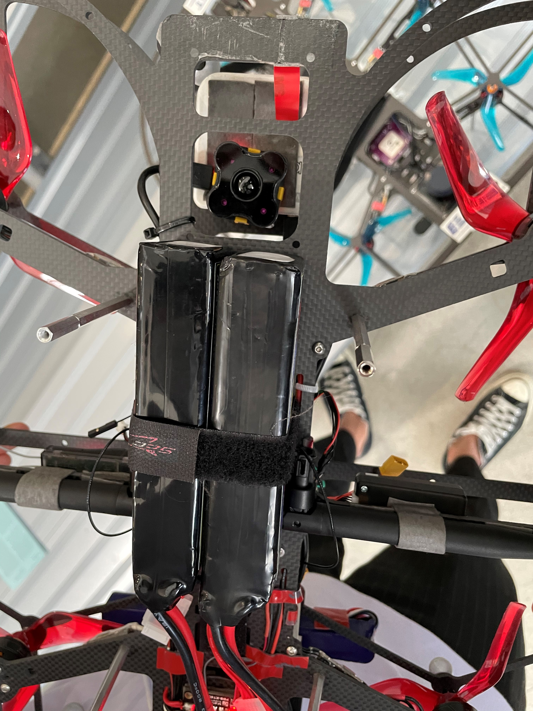
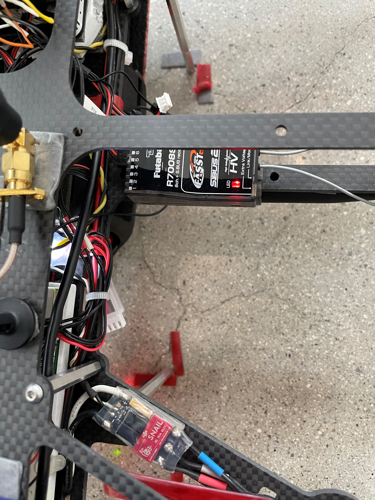

# mmca_gim

MMCA - The Ghost in the Machine \
안정주/전소정 <기계속의 유령> @ 국립현대미술관(MMCA) \
5.14(Fri) ~ 6.12(Sat)


## USRG Auto-flight Manual

### 도구 셋업
1. `모니터링 랩탑` 부팅(Ubuntu for ROS). 파일럿 테이블에 올려두기.
2. WiFi 라우터 전원 켜기. 손/발에 안닿는 안전한 곳에 두기.
3. 4셀 3000 mAh 배터리 3 쌍 준비(드론에 장착 1 / 충전 2)

### 드론 부팅
1. 배터리 1 쌍 준비. 전압 체크해서 90% 이상이면 비행 가능.
3. 드론에 배터리 연결.
4. 벨크로를 이용해 단단히 고정. ***무게 밸런스 중요***.(아래 사진 참고) 


### 모니터링 랩탑 셋업
1. (*터미널 준비*) 터미널 탭 2개를 엶. 탭 1은 10개, 탭 2는 2개로 나눔.
2. (*SSH 로그인*) 탭 1에서 드론의 TX2에 다음 alias를 이용해 SSH로 로그인
    ```bash
    ssh19scout
    ```
    > 참고)
    > ```bash
    > alias ssh19scout='ssh nvidia@192.168.1.22'
    > ```
3. (*Launch command*) 탭 1에서 각 창에 다음을 입력.(10개). *1_(tab) 2_(tab) 하면 되는데 정확한 내용은 수정할 예정*
    ```bash
    ping 192.168.1.22
    roscore
    1_teraranger
    2_mavros
    3_cartographer
    4_mission
    5_tf_listener
    6_distance
    7_astar
    8_offboard
    ```
4.  탭 2에서 각 창에 다음을 입력(2개)
    ```bash
    ./QGroundControl(tab)
    rviz
    ```
5. `teraranger` 오류시 테라레이저 USB와 키보드마우스 동글 USB 제거 -> 다시 연결 -> 재시도
    > 그래도 오류시 TX2 재부팅


### 비행 전 체크 사항
1. 배터리 체크. 90% 이상이면 비행 가능.
2. 카메라 잘 붙어있는지 확인.
3. 전선 정리.
4. 드론을 정확한 위치에 놓기. **랜딩기어를 바닥 표시에 정확히 맞추기.**(아래 사진 참고) 
5. (*astar*) **시작 위치에서 드론의 왼쪽 후방(약 1m 거리)에 occupancy가 생기지 않도록 확인.**
   > 대처법: 그물이 라이다에 안잡히게 멀리 밀기.


### 비행 중 모니터링 방법
이상 발생시 가장 먼저 알아챌 수 있는 순서대로 나열함.

1. `모니터링 랩탑 셋업`에서 연 터미널 창과 rviz
    - (*astar*) **rviz에서 astar 경로가 깨끗한지 확인한다.** 경로가 구불구불하거나 장애물 사이로 경로를 생성할 수 있음.
        > 대처법: 이상 발견시 조종기 POSCTL 모드 -> 경로 정상화 확인 -> 조종기 OFFBOARD 모드.
    - (*astar*) **rviz에서 astar 경로가 계속 업데이트 되는지 확인한다.** astar 노드는 가끔 fail날 수 있음.
        > 대처법: 조종기 POSCTL 모드 -> 모니터링 랩탑에서 astar 노드 재시작 -> 조종기 OFFBOARD 모드 -> 자율비행 계속.
    - (*cartographer*) rviz에서 `base_link`의 위치 확인
        > 대처법: 조종기 STABLIZED 모드 -> 착륙 시도.
    - 터미널에서 ping 상태 확인.

2. 실제 비행 중인 기체

3. 카메라 송출 이미지
    - rviz에 모든 occupancy가 보인다는 보장은 없으므로 실제 카메라 이미지 참고.

### 비행 후 체크 사항

### 기타 오류 대응법
1. 조종기 arming 오류
    > QGroundControl 이용 PX4 재부팅 -> *launch command* 재실행.

